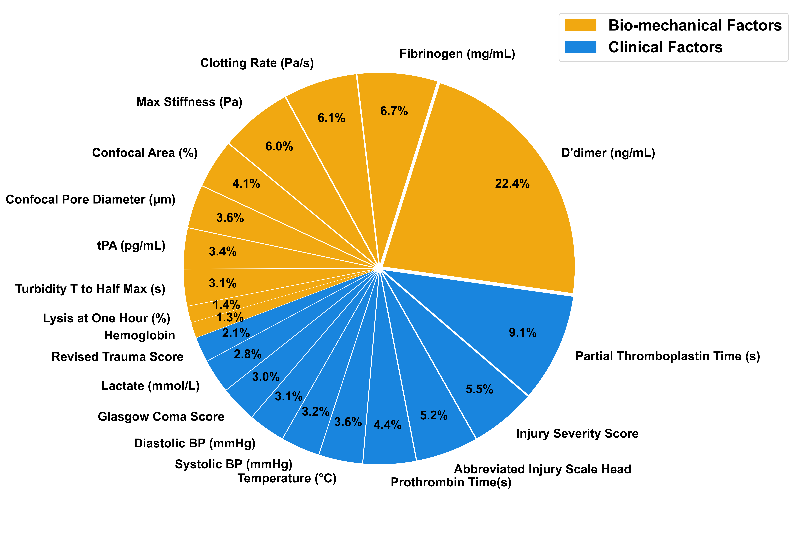

<a href="https://doi.org/10.5281/zenodo.10799013"></a>

# Integrative Bio-mechanical and Clinical Features Predict In-Hospital Trauma Mortality

### Installation

```
conda create --name env_tr
conda activate env_tr
pip install -r requirements.txt
```

### Methods:

We performed binary classification using both clinical and biomechanical variables (f=103,n=63) to predict in-hospital trauma mortality. Methods evaluated include: logistic regression with ridge regularization (sklearn.linear_model library in python), support vector classifier (sklearn.svm), neural network (tensorflow.keras), and random forest(sklearn.ensemble). Random forest modeling after recursive feature elimination(identifying 16 integrative features from both data types) predicted 3-day in-hospital mortality at the highest accuracy (88%) with 5-fold mean Cross Validation Score of 84.26%.
### Results:

Using trauma patient clinical and clot mechanics data derived in-hospital and at our research laboratory respectively, we identify 16 significant features (based on Gini index of random forest modeling) as potential contributors and predictors of in-hospital mortality. Features identified both confirm previously known clinical variables (e.g. PT, PTT, D-dimer) as well as offer new candidates (e.g. clot polymerization rate) that together contribute to improved prediction of mortality than current clinical severity scales (Figure 1, e.g. injury severity score ISS or abbreviated injury scale AIS_HEAD).

</img>

### Conclusion:

The study indicates that clot mechanics(bio-mechanical features) play a significant role and provide a unique dimension for evaluating trauma mortality over and above current patient in-hospital clinical measurements.
